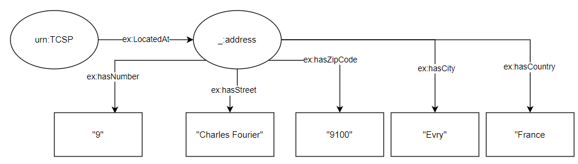
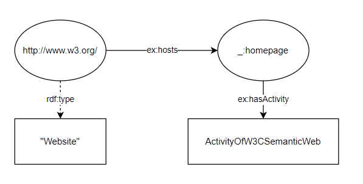
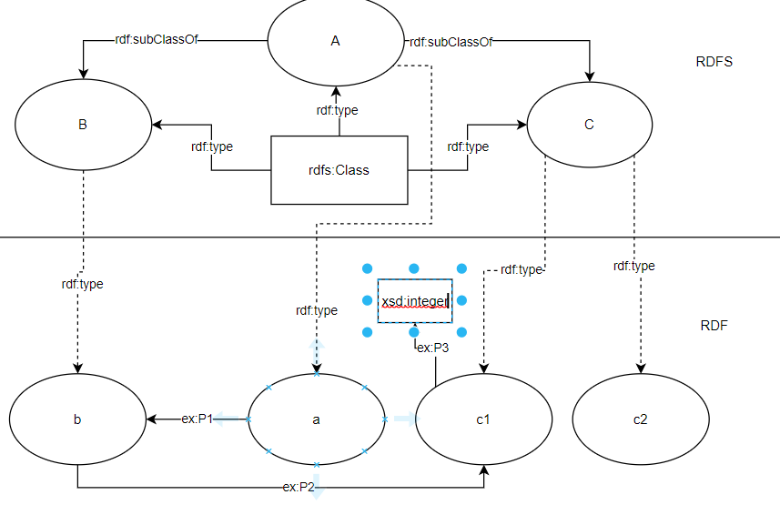
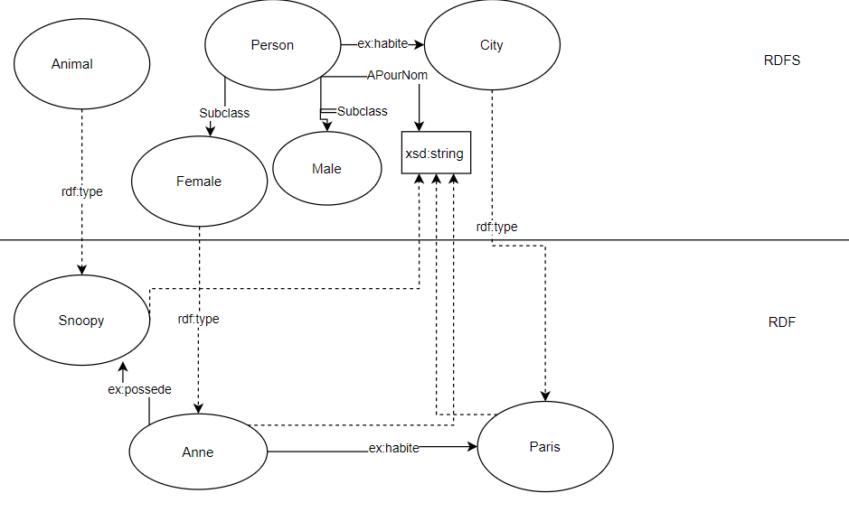

# RDF Exercises
## Exercise 1
Take the following natural language sentences: 
 - "TELECOM SudParis is located at 9 rue Charles Fourier 91000, Evry, France" 
 - "The web site http://www.w3.org/ hosts the homepage for the W3C Semantic Web 
activity" 

### a)

```
<urn:TelecomSudParis><ex:LocatedAt><urn:LocationOfTelecomSudParis>
<urn.LocationOfTelecomSudParis><ex:hasNumber> "9"
<urn.LocationOfTelecomSudParis><ex:hasStreet> "Charles Fourier"
<urn.LocationOfTelecomSudParis><ex:hasZipCode> "9100"
<urn.LocationOfTelecomSudParis><ex:hasCity> "Evry"
<urn.LocationOfTelecomSudParis><ex:hasCountry> "France"

<http://www.w3.org/><rdf:type> "Website"
<http://www.w3.org/><ex:hosts><ex:homepage>
<ex:homepage><ex:hasActivity><urn:ActivityOfW3CSemanticWeb>
```

### b)

```
<urn:TelecomSudParis><ex:LocatedAt><_:address>
<_:address><ex:hasNumber> "9"
<_:address><ex:hasStreet> "Charles Fourier"
<_:address><ex:hasZipCode> "9100"
<_:address><ex:hasCity> "Evry"
<_:address><ex:hasCountry> "France"

<http://www.w3.org/><rdf:type> "Website"
<http://www.w3.org/><ex:hosts><_:homepage>
<_:homepage><ex:hasActivity><urn:ActivityOfW3CSemanticWeb>
ActivityOfW3CSemanticWeb <ex:hasHomePage> <_:homepage>
```

## Exercise 2




## Exercise 3
```
<ex:John><rdf:type><foaf:Person>
<ex:Mary><rdf:type><foaf:Person>

<ex:Marriage><rdfs:range><foaf:Person>
<ex:couple1><ex:Marriage><ex:John>
<ex:couple1><ex:Marriage><ex:Mary>
///
<ex:John><ex:isHusband><ex:Mary>
<ex:Mary><ex:isWife><ex:John>

<!-- countinue -->

<ex:John><ex:wasBorn><ex:LocationDate>
<ex:LocationDate><ex:isDate><_:Date>


<_:Date><ex:Day> "01"
<_:Date><ex:Month> "01"
<_:Date><ex:Year> "1975"

<ex:LocationDate><ex:isCity><ex:Location>

<ex:Location><ex:City><urn:Galway>
<urn:Galway><ex:hasPoint><ex:Point>
<ex:Point><rdf:type><geo:Point>
<geo:Point><rdf:type><geo:lat>
<geo:Point><rdf:type><geo:long>
<geo:lat><rdf:literal> "55.701"
<geo:long><rdf:literal> "12.552"

<ex:John><ex:haschildren><ex:children>
<ex:children><rdf:type><rdf:bag>
<ex:children><rdf:1> "Brian"
<ex:children><rdf:2> "Sinead"
<ex:children><rdf:3> "David"

<ex:John><ex:haschildren><ex:children>
<ex:children><rdf:type><rdf:seq>
<ex:children><rdf:1> "Brian"
<ex:children><rdf:2> "Sinead"
<ex:children><rdf:3> "David"


<urn:Galway><ex:transportationMedium> "Train"
<urn:Galway><ex:transportationMedium> "Bus"
<urn:Galway><ex:transportationMedium> "Plane"


```

# RDFS exercises
## Exercise 1


## Exercise 2


## Exercise 3

```
ex:Research-institution rdfs:subClassOf ex:Institution ex:Educational-institution rdfs:subClassOf ex:Institution ex:University rdfs:subClassOf ex:Research-institution ex:University rdfs:subClassOf ex:Educational-institution ex:Faculty rdfs:subClassOf ex:Person
ex:Student rdfs:subClassOf ex:Person ex:Phd-Student rdfs:subClassOf ex:Faculty ex:Phd-Student rdfs:subClassOf ex:Student ex:Msc-Student rdfs:subClassOf ex:Student ex:Msc-Student rdfs:comment "An Msc student is not a faculty"
ex:Phd-Student rdfs:comment "A student who is also a faculty is a PhD Student"
ex:employed-by rdfs:domain ex:Person ex:employed-by rdfs:range ex:Institution ex:manager-of rdfs:domain ex:Person
ex:manager-of rdfs:range ex:Person


```

## Exercise 5

```
ex:Pizza ex:consists_of ex:Base
ex:Pizza ex:consists_of ex:Topping
ex:Base rdf:type "Pizza base"
ex:Topping rdf:type "Pizza topping"

ex:DeepPanBase rdfs:subClassOf ex:Base
ex:ThinCrispyBase rdfs:subClassOf ex:Base


ex:Cheese rdfs:subClassOf ex:Topping
ex:Meat rdfs:subClassOf ex:Topping
ex:Seafood rdfs:subClassOf ex:Topping
ex:Vegetable rdfs:subClassOf ex:Topping


ex:Cheesy rdfs:subClassOf ex:Pizza
ex:Named rdfs:subClassOf ex:Pizza
ex:Vegetarian rdfs:subClassOf ex:Pizza

ex:American rdfs:subClassOf ex:Named
ex:AmericanHot rdfs:subClassOf ex:Named
ex:Margherita rdfs:subClassOf ex:Named
ex:Soho rdfs:subClassOf ex:Named


```