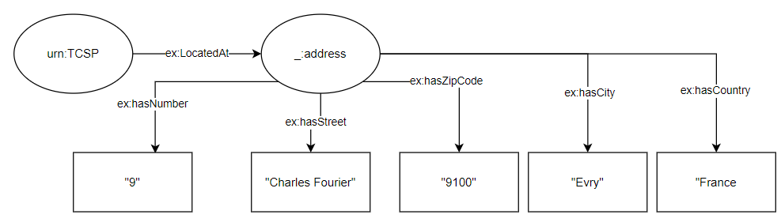

# RDF Exercises
## Exercise 1
Take the following natural language sentences: 
 - "TELECOM SudParis is located at 9 rue Charles Fourier 91000, Evry, France" 
 - "The web site http://www.w3.org/ hosts the homepage for the W3C Semantic Web 
activity" 

### a)

```
<urn:TelecomSudParis><ex:LocatedAt><urn:LocationOfTelecomSudParis>
<urn.LocationOfTelecomSudParis><ex:hasNumber> "9"
<urn.LocationOfTelecomSudParis><ex:hasStreet> "Charles Fourier"
<urn.LocationOfTelecomSudParis><ex:hasZipCode> "9100"
<urn.LocationOfTelecomSudParis><ex:hasCity> "Evry"
<urn.LocationOfTelecomSudParis><ex:hasCountry> "France"

<http://www.w3.org/><rdf:type> "Website"
<http://www.w3.org/><ex:hosts><ex:homepage>
<ex:homepage><ex:hasActivity><urn:ActivityOfW3CSemanticWeb>
```

### b)

```
<urn:TelecomSudParis><ex:LocatedAt><_:address>
<_:address><ex:hasNumber> "9"
<_:address><ex:hasStreet> "Charles Fourier"
<_:address><ex:hasZipCode> "9100"
<_:address><ex:hasCity> "Evry"
<_:address><ex:hasCountry> "France"

<http://www.w3.org/><rdf:type> "Website"
<http://www.w3.org/><ex:hosts><_:homepage>
<_:homepage><ex:hasActivity><urn:ActivityOfW3CSemanticWeb>
ActivityOfW3CSemanticWeb <ex:hasHomePage> <_:homepage>
```

## Exercise 2



## Exercise 3
```
<ex:John><rdf:type><foaf:Person>
<ex:Mary><rdf:type><foaf:Person>

<ex:Marriage><rdfs:range><foaf:Person>
<ex:couple1><ex:Marriage><ex:John>
<ex:couple1><ex:Marriage><ex:Mary>
///
<ex:John><ex:isHusband><ex:Mary>
<ex:Mary><ex:isWife><ex:John>

<!-- countinue -->

<ex:John><ex:wasBorn><ex:LocationDate>
<ex:LocationDate><ex:isDate><_:Date>


<_:Date><ex:Day> "01"
<_:Date><ex:Month> "01"
<_:Date><ex:Year> "1975"

<ex:LocationDate><ex:isCity><ex:Location>

<ex:Location><ex:City><urn:Galway>
<urn:Galway><ex:hasPoint><ex:Point>
<ex:Point><rdf:type><geo:Point>
<geo:Point><rdf:type><geo:lat>
<geo:Point><rdf:type><geo:long>
<geo:lat><rdf:literal> "55.701"
<geo:long><rdf:literal> "12.552"

<ex:John><ex:haschildren><ex:children>
<ex:children><rdf:type><rdf:bag>
<ex:children><rdf:1> "Brian"
<ex:children><rdf:2> "Sinead"
<ex:children><rdf:3> "David"

<ex:John><ex:haschildren><ex:children>
<ex:children><rdf:type><rdf:seq>
<ex:children><rdf:1> "Brian"
<ex:children><rdf:2> "Sinead"
<ex:children><rdf:3> "David"


<urn:Galway><ex:transportationMedium> "Train"
<urn:Galway><ex:transportationMedium> "Bus"
<urn:Galway><ex:transportationMedium> "Plane"

```
- Figure:


```xml
<?xml version="1.0"?>

<rdf:RDF xmlns:rdf="http://www.w3.org/1999/02/22-rdf-syntax-ns#" xmlns:dc="http://purl.org/dc/elements/1.1/" xmlns:ex="http://example.org/stuff/1.0/">

  <rdf:Description rdf:about="ex:Mary"></rdf:Description>
  <rdf:Description rdf:about="ex:John"></rdf:Description>
<!-- John is the husband of Mary-->
  <rdf:Description rdf:about="ex:John">
    <rdf:type rdf:resource="ex:Husband"/>
    <rdf:type rdf:resource="ex:Person"/>
    <ex:spouse rdf:resource="ex:Mary"/>
  </rdf:Description>
<!-- Mary is the wife of John-->
  <rdf:Description rdf:about="ex:Mary">
    <rdf:type rdf:resource="ex:Wife"/>
    <rdf:type rdf:resource="ex:Person"/>
    <ex:spouse rdf:resource="ex:John"/>
  </rdf:Description>

<!-- John was the 1st of january 1975-->
  <rdf:description rdf:about="ex:John">
    <ex:wasBornIn rdf:nodeID="JohnDateOfBirth">
      <rdf:bag rdf:nodeID="JohnDateOfBirth">
        <ex:DayOfBirth rdf:datatype="xsd:Integer">01</ex:DayOfBirth>
        <ex:MonthOfBirth rdf:datatype="xsd:String">July</ex:MonthOfBirth>
        <ex:YearOfBirth rdf:datatype="xsd:Integer">1975</ex:YearOfBirth>
      </rdf:bag>
    </ex:wasBornIn>
  </rdf:description>


<!-- The city of galway with latitude and longitude-->
<rdf:Description rdf:about="ex:Galway">
  <ex:latitude rdf:datatype="xsd:float">53.2734</ex:latitude>
  <ex:longitude rdf:datatype="xsd:float">-9.05138</ex:longitude>
</rdf:Description>

<!-- John was born in the city of Galway-->
  <rdf:description rdf:about="ex:John">
    <ex:wasBornIn rdf:nodeID="JohnDateOfBirth">
      <rdf:bag rdf:nodeID="JohnDateOfBirth">
        <ex:CityOfBirth rdf:resource="ex:Galway"></ex:CityOfBirth>
      </rdf:bag>
    </ex:wasBornIn>
  </rdf:description>


<!-- John has the following children: Brian, Sinead and David-->
  <rdf:description rdf:about="ex:John">
    <ex:hasChild rdf:nodeID="JohnChildren">
      <rdf:bag rdf:nodeID="JohnChildren">
        <rdf:li rdf:resource="ex:Brian"/>
        <rdf:li rdf:resource="ex:Sinead"/>
        <rdf:li rdf:resource="ex:David"/>
      </rdf:bag>
    </ex:hasChild>
  </rdf:description>

<!-- John has the following children in this order: Brian, Sinead and David-->
  <rdf:description rdf:about="ex:John">
    <ex:hasChild rdf:nodeID="JohnChildren">
      <rdf:seq rdf:nodeID="JohnChildren">
        <rdf:_1 rdf:resource="ex:Brian"/>
        <rdf:_2 rdf:resource="ex:Sinead"/>
        <rdf:_3 rdf:resource="ex:David"/>
      </rdf:seq>
    </ex:hasChild>
  </rdf:description>


<!-- ex:Galway can be accessed by either train, bus or plane-->
<rdf:description>
  <ex:canBeAccessedBy rdf:nodeID="GalwayAccess">
    <rdf:bag rdf:nodeID="GalwayAccess">
      <rdf:li rdf:resource="ex:train"/>
      <rdf:li rdf:resource="ex:bus"/>
      <rdf:li rdf:resource="ex:plane"/>
    </rdf:bag>
  </ex:canBeAccessedBy>
</rdf:description>

<!-- ex:Galway can be reached only by train, by bus or by plane (X(clusive))-->
<rdf:description>
  <ex:canBeReachedBy rdf:nodeID="GalwayXReach">
    <rdf:alt rdf:nodeID="GalwayXReach">
      <rdf:li rdf:resource="ex:train"/>
      <rdf:li rdf:resource="ex:bus"/>
      <rdf:li rdf:resource="ex:plane"/>
    </rdf:alt>
  </ex:canBeReachedBy>
</rdf:description>

</rdf:RDF>
```

# RDFS exercises
## Exercise 1


## Exercise 2


## Exercise 3

```
ex:Research-institution rdfs:subClassOf ex:Institution ex:Educational-institution rdfs:subClassOf ex:Institution 
ex:University rdfs:subClassOf ex:Research-institution 
ex:University rdfs:subClassOf ex:Educational-institution 

ex:Faculty rdfs:subClassOf ex:Person
ex:Student rdfs:subClassOf ex:Person 
ex:Phd-Student rdfs:subClassOf ex:Faculty 
ex:Phd-Student rdfs:subClassOf ex:Student 
ex:Msc-Student rdfs:subClassOf ex:Student 
ex:Msc-Student rdfs:comment "An Msc student is not a faculty"
ex:Phd-Student rdfs:comment "A student who is also a faculty is a PhD Student"
ex:employed-by rdfs:domain ex:Person 
ex:employed-by rdfs:range ex:Institution 
ex:manager-of rdfs:domain ex:Person
ex:manager-of rdfs:range ex:Person

```

## Exercise 4
Extenstion of the Vocab with instances
```
ex:CoolUni rdf:type ex:University
ex:CoolUni rdfs:label "Cool University"
ex:OldUni rdf:type ex:University
ex:OldUni rdfs:label "Old University"


ex:John rdf:type ex:Msc-Student
ex:Mary rdf:type ex:Phd-Student
ex:Karen rdf:type ex:Faculty
ex:Filip rdf:type ex:Faculty

ex:Filip ex:manager-of ex:Karen
ex:Karen ex:employed-by ex:Filip
ex:filip ex:employed-by ex:CoolUni

ex:Class rdfs:domain ex:Student
ex:Class rdfs:range ex:Faculty

<ex:Class><ex:hasStudents><ex:StudentGroup>

<ex:StudentGroup><rdf:type><rdf:bag>
<ex:StudentGroup><rdf:1> "Brian"
<ex:StudentGroup><rdf:2> "Sinead"
<ex:StudentGroup><rdf:3> "David"

```

## Exercise 5

```
ex:Pizza ex:consists_of ex:Base
ex:Pizza ex:consists_of ex:Topping
ex:Base rdf:type "Pizza base"
ex:Topping rdf:type "Pizza topping"

ex:DeepPanBase rdfs:subClassOf ex:Base
ex:ThinCrispyBase rdfs:subClassOf ex:Base


ex:Cheese rdfs:subClassOf ex:Topping
ex:Meat rdfs:subClassOf ex:Topping
ex:Seafood rdfs:subClassOf ex:Topping
ex:Vegetable rdfs:subClassOf ex:Topping


ex:Cheesy rdfs:subClassOf ex:Pizza
ex:Named rdfs:subClassOf ex:Pizza
ex:Vegetarian rdfs:subClassOf ex:Pizza

ex:American rdfs:subClassOf ex:Named
ex:AmericanHot rdfs:subClassOf ex:Named
ex:Margherita rdfs:subClassOf ex:Named
ex:Soho rdfs:subClassOf ex:Named


```